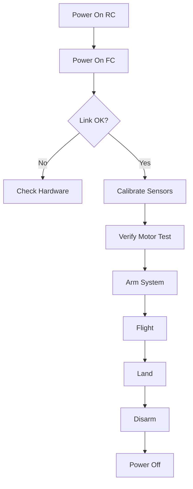

# DIY Drone Flight Control System

<div align="center">

**A complete Arduino-based quadcopter flight controller with wireless RC control**


</div>

---

## 🚁 Features

### Flight Controller
- ✅ **PID-based stabilization** for smooth, stable flight
- ✅ **MPU6050 integration** for 6-axis motion sensing
- ✅ **MS5611 barometer** for altitude hold
- ✅ **Kalman filtering** for sensor fusion
- ✅ **NRF24L01 wireless** with ACK confirmation
- ✅ **30° safety angle limit** prevents crashes
- ✅ **Communication loss detection** auto-lands on signal loss
- ✅ **EEPROM calibration storage** remembers settings
- ✅ **140Hz control loop** for responsive flight

### RC Controller
- ✅ **Dual joystick control** (throttle, yaw, pitch, roll)
- ✅ **Calibration button** for sensor setup
- ✅ **Smooth motor start** for pre-flight testing
- ✅ **Arm/disarm switch** with safety confirmation
- ✅ **Altitude hold toggle** for hands-free hovering
- ✅ **Visual feedback** with status LED
- ✅ **~100m range** line-of-sight

---

## 📦 Hardware Requirements

### Flight Controller Components

| Component | Quantity | Notes |
|-----------|----------|-------|
| Arduino Nano | 1 | ATmega328P |
| MPU6050 | 1 | 6-axis gyro/accelerometer |
| MS5611 | 1 | Barometer (altitude sensor) |
| NRF24L01 | 1 | With adapter (3.3V) |
| ESCs | 4 | 20-30A with BEC |
| Brushless Motors | 4 | 1000-2000 KV |
| Propellers | 4 | Matching motor size |
| LiPo Battery | 1 | 3S or 4S, 2200+ mAh |
| Buzzer | 1 | Active 5V buzzer |
| LED | 1 | Any color, 5mm |
| Resistor | 1 | 220Ω for LED |
| Capacitor | 1 | 10µF for NRF24L01 |

### RC Controller Components

| Component | Quantity | Notes |
|-----------|----------|-------|
| Arduino Nano | 1 | ATmega328P |
| NRF24L01 | 1 | With adapter (3.3V) |
| Joystick Modules | 2 | Analog 2-axis |
| Push Buttons | 2 | Momentary, normally open |
| Toggle Switches | 2 | SPDT or SPST |
| LED | 1 | Any color, 5mm |
| Resistor | 1 | 220Ω for LED |
| Capacitor | 1 | 10µF for NRF24L01 |
| Battery | 1 | 9V or 7.4V LiPo |

### Tools Needed
- Soldering iron & solder
- Wire strippers
- Multimeter
- USB cable for Arduino programming
- Propeller balancer (recommended)
- Spirit level (for calibration)

---

## 🔧 Quick Start

### 1. Hardware Assembly

Follow the detailed wiring diagram in [`WIRING_DIAGRAM.md`](WIRING_DIAGRAM.md)

**Key Points:**
- ⚠️ **NRF24L01 uses 3.3V, not 5V!**
- ⚠️ **Add 10µF capacitor on NRF24L01 power pins**
- ⚠️ **Ensure common ground between all components**
- ⚠️ **Double-check motor rotation directions**

### 2. Software Installation

#### Required Libraries
Install via Arduino IDE Library Manager:
- `RF24` by TMRh20
- `MS5611` by Rob Tillaart
- `Smoothed` by Matthew Fryer
- `Wire` (built-in)
- `SPI` (built-in)
- `Servo` (built-in)
- `EEPROM` (built-in)

#### Upload Code
1. Open `Drone_Flight_Controller/Drone_Flight_Controller.ino`
2. Select **Board:** Arduino Nano
3. Select **Processor:** ATmega328P (Old Bootloader if needed)
4. Upload to flight controller

5. Open `RC_Controller/RC_Controller.ino`
6. Upload to RC controller

### 3. Initial Setup

1. **Power on RC controller first** (always!)
2. **Power on flight controller**
3. Wait for link confirmation (beeps + LED)
4. **Calibrate sensors:**
   - Place drone on level surface
   - Switch 1 = 1 (disarmed)
   - Hold Button 1 for 2 seconds
   - Wait for calibration completion

5. **Test motors:**
   - Switch 1 = 0 (arm)
   - Press Button 2 (smooth start)
   - Verify all motors spin correctly

6. **First flight:**
   - Start in open area
   - Gentle throttle inputs
   - Stay close to ground
   - Practice hovering

---

## 📖 Documentation

| Document | Description |
|----------|-------------|
| [**USER_MANUAL.md**](USER_MANUAL.md) | Complete operating instructions |
| [**WIRING_DIAGRAM.md**](WIRING_DIAGRAM.md) | Detailed connection diagrams |
| [**CALIBRATION_GUIDE.md**](CALIBRATION_GUIDE.md) | Sensor calibration procedures |
| [**TROUBLESHOOTING.md**](TROUBLESHOOTING.md) | Common issues & solutions |

---

## 🎮 Controls Overview

### RC Controller Layout

```
╔════════════════════════════════════════╗
║  [LED]                    [Button 1]  ║
║                           [Button 2]  ║
║                                        ║
║    LEFT STICK          RIGHT STICK    ║
║                                        ║
║   Throttle (↕)         Pitch (↕)      ║
║   Yaw (←→)             Roll (←→)      ║
║                                        ║
║  [Switch 1]            [Switch 2]     ║
║  Arm/Disarm            Altitude Hold  ║
╚════════════════════════════════════════╝
```

### Button Functions

| Control | Function | Action |
|---------|----------|--------|
| **Button 1** | Calibration | Hold 2s (when disarmed) |
| **Button 2** | Motor Test | Press once (when armed) |
| **Switch 1 (UP)** | Disarm | Safe mode, LED ON |
| **Switch 1 (DOWN)** | Arm | Flight ready, LED blinks |
| **Switch 2 (UP)** | Manual | Normal flight mode |
| **Switch 2 (DOWN)** | Alt Hold | Maintain altitude |

---

## 🔒 Safety Features

### 1. Maximum Tilt Angle (30°)
Prevents loss of control from excessive tilting. Drone auto-stops if angle exceeds limit.

### 2. Communication Loss Detection
If RC signal lost for >3 seconds, motors stop and buzzer alerts.

### 3. Arm/Disarm Protection
LED stays ON when disarmed as visual warning. Motors only respond when armed.

### 4. Throttle Limiting
Maximum thrust limited to 1700µs (not full 2000µs) for safety margin.

### 5. Ground Effect Protection
Altitude hold only activates in safe throttle range (1400-1450µs).

---

## 🛠️ Tuning & Configuration

### PID Tuning

Default values (tested stable):
```cpp
const float kp = 2.0;      // Proportional gain
const float ki = 0.0001;   // Integral gain (keep small!)
const float kd = 0.5;      // Derivative gain
```

**Oscillates?** → Reduce `kp` and `kd`  
**Sluggish?** → Increase `kp` and `kd`  
**Drifts?** → Slightly increase `ki`

### Altitude Hold Tuning

```cpp
float pid_p_gain_altitude = 14.0;
float pid_i_gain_altitude = 2.0;
float pid_d_gain_altitude = 7.5;
```

**Fluctuates?** → Increase `pid_d_gain_altitude`  
**Slow response?** → Increase `pid_p_gain_altitude`  
**Drifts over time?** → Increase `pid_i_gain_altitude`

### Control Sensitivity

Adjust in flight controller:
```cpp
float sensiX = -0.45;     // Roll
float sensiY = 0.45;      // Pitch
float sensiZ = -0.01;     // Yaw
float sensiThrust = 1.1;  // Throttle
```

---

## 🐛 Common Issues

### Motors Don't Spin
1. Check ESC calibration
2. Verify signal wire connections (D3, D5, D6, D9)
3. Ensure battery voltage >11V
4. Test ESCs individually

### Won't Link to RC
1. Power RC **before** flight controller
2. Check NRF24L01 has 3.3V power
3. Verify 10µF capacitor on NRF24L01
4. Check both use same channel (108) and pipe address

### Drifts in Hover
1. Calibrate on level surface
2. Balance propellers
3. Check for frame flex
4. Verify motor thrust uniformity

### Altitude Hold Issues
1. Shield barometer from prop wash
2. Calibrate MS5611
3. Only activate at hover throttle
4. Tune altitude PID gains

**See [TROUBLESHOOTING.md](TROUBLESHOOTING.md) for complete guide**

---

## 📊 System Architecture

```
┌─────────────────────────────────────────────────────────────┐
│                     RC CONTROLLER                            │
│  ┌──────────┐  ┌──────────┐  ┌──────────┐  ┌──────────┐   │
│  │Joystick L│  │Joystick R│  │ Buttons  │  │ Switches │   │
│  └─────┬────┘  └─────┬────┘  └─────┬────┘  └─────┬────┘   │
│        └──────────────┴─────────────┴─────────────┘         │
│                         │                                    │
│                    ┌────▼────┐                               │
│                    │ Arduino │                               │
│                    │  Nano   │                               │
│                    └────┬────┘                               │
│                         │                                    │
│                    ┌────▼────┐                               │
│                    │NRF24L01 │◄────── 2.4GHz Wireless       │
│                    └─────────┘                               │
└─────────────────────────────────────────────────────────────┘
                             │
                             │ ~100m Range
                             ▼
┌─────────────────────────────────────────────────────────────┐
│                  FLIGHT CONTROLLER                           │
│                    ┌─────────┐                               │
│                    │NRF24L01 │                               │
│                    └────┬────┘                               │
│                         │                                    │
│                    ┌────▼────┐                               │
│                    │ Arduino │                               │
│     ┌─────────────►│  Nano   │◄─────────────┐               │
│     │              └────┬────┘              │               │
│     │                   │                   │               │
│ ┌───▼───┐          ┌───▼───┐          ┌────▼────┐          │
│ │MPU6050│          │MS5611 │          │ 4x ESCs │          │
│ │Gyro/  │          │Baro   │          │         │          │
│ │Accel  │          │meter  │          └────┬────┘          │
│ └───────┘          └───────┘               │               │
│                                        ┌────▼────┐          │
│    ┌────────┐  ┌──────┐               │ 4x      │          │
│    │ Buzzer │  │ LED  │               │ Motors  │          │
│    └────────┘  └──────┘               └─────────┘          │
│                                                              │
│  140 Hz Control Loop                                         │
│  • Read Sensors                                              │
│  • Calculate PID                                             │
│  • Update Motors                                             │
└─────────────────────────────────────────────────────────────┘
```

---

## 📈 Performance Specs

| Metric | Value |
|--------|-------|
| Control Loop Rate | 140 Hz (7.14ms) |
| Radio Update Rate | ~50 Hz |
| Barometer Read Rate | ~14 Hz |
| Maximum Tilt Angle | 30° |
| Wireless Range | ~100m (line-of-sight) |
| Latency | <50ms end-to-end |
| Battery Life | 5-15 minutes (depends on battery/motors) |

---

## 🔄 Operational Workflow



---

## 📝 Code Structure

### Flight Controller
```
Drone_Flight_Controller/
├── Drone_Flight_Controller.ino  # Main control loop
├── Barometer.ino                # MS5611 altitude control
├── Kalman_Filter.ino            # Sensor fusion
├── Gyro.h                       # MPU6050 interface
└── Gyro.cpp                     # MPU6050 implementation
```

### RC Controller
```
RC_Controller/
└── RC_Controller.ino            # Joystick & wireless TX
```

---

## 🚀 Future Enhancements

Potential upgrades:
- [ ] GPS waypoint navigation
- [ ] FPV camera integration
- [ ] Telemetry data logging
- [ ] Mobile app control
- [ ] Autonomous landing
- [ ] Battery voltage monitoring
- [ ] Flip/acro mode
- [ ] LED strip support

---

## ⚠️ Legal & Safety Disclaimer

**IMPORTANT:**
- This is an experimental DIY project
- Fly only in designated areas
- Follow local drone regulations
- Never fly near airports or people
- You are responsible for safe operation
- Test thoroughly before first flight
- Wear eye protection during testing
- Keep fingers away from spinning propellers

**By using this code, you accept full responsibility for any damage or injury that may occur.**

---

## 📜 License

MIT License - See LICENSE file for details

Free to use, modify, and distribute with attribution.

---

## 🤝 Contributing

Contributions welcome! Please:
1. Fork the repository
2. Create feature branch
3. Test thoroughly
4. Submit pull request

---

## 💬 Support

**Having issues?**
1. Check [TROUBLESHOOTING.md](TROUBLESHOOTING.md)
2. Review serial monitor output
3. Verify wiring against diagram
4. Test components individually

---

## 📚 Additional Resources

### Recommended Reading
- [MPU6050 Datasheet](https://invensense.tdk.com/products/motion-tracking/6-axis/mpu-6050/)
- [MS5611 Datasheet](https://www.te.com/usa-en/product-CAT-BLPS0036.html)
- [NRF24L01 Getting Started](https://lastminuteengineers.com/nrf24l01-arduino-wireless-communication/)
- [PID Control Theory](https://en.wikipedia.org/wiki/PID_controller)

### Video Tutorials
Search YouTube for:
- "Arduino drone PID tuning"
- "NRF24L01 troubleshooting"
- "Quadcopter motor calibration"
- "MPU6050 calibration"

---

## 🎯 Version History

### v1.0.0 (Current)
- ✅ Full PID stabilization
- ✅ Altitude hold functionality
- ✅ NRF24L01 with ACK
- ✅ Safety features (angle limit, comm loss)
- ✅ Calibration system
- ✅ Smooth motor start
- ✅ Comprehensive documentation

---

<div align="center">

**Built with ❤️ for the DIY drone community**

*Fly safe, fly smart! 🚁*

</div>
