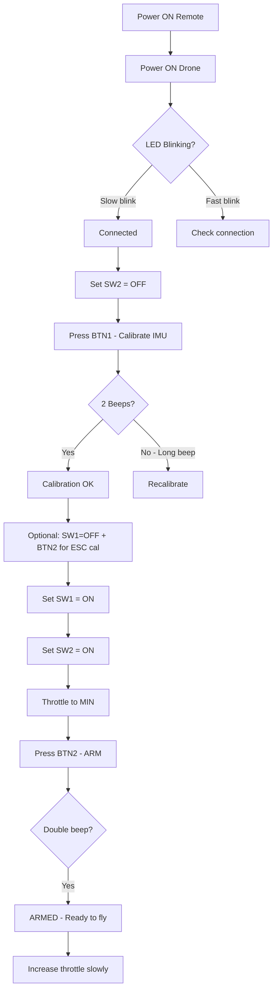

# Professional Drone System

## Arduino Nano Quadcopter Flight Controller & Remote Controller

A complete, professional-grade quadcopter control system built on Arduino Nano microcontrollers with reliable NRF24L01 PA+LNA wireless communication.


---

## 🚀 Features

### Flight Controller
- **6-axis IMU stabilization** using MPU6050 with complementary filter
- **PID control** for Roll, Pitch, and Yaw stability
- **250Hz control loop** for responsive handling
- **Failsafe protection** with automatic disarm on signal loss
- **ESC calibration mode** with motor test sequence
- **Real-time telemetry** via ACK payloads

### Remote Controller
- **Dual joystick control** (Throttle/Yaw + Pitch/Roll)
- **Physical safety switches** (Kill switch, Altitude hold)
- **Calibration buttons** for IMU and ESC
- **Live serial monitor** displaying all telemetry data
- **Signal quality monitoring** with visual indicators

### Safety Features
- **30° maximum tilt angle** - prevents dangerous flips
- **65% throttle cap** - prevents uncontrolled climbs
- **Kill switch** - instant motor cutoff
- **Failsafe timeout** - gradual descent on signal loss
- **Low throttle arming requirement** - prevents accidental arm

---

## 📋 Hardware Requirements

### Flight Controller Board

| Component | Specification | Connection |
|-----------|--------------|------------|
| Arduino Nano | ATmega328P | - |
| NRF24L01 PA+LNA | 2.4GHz Radio | CE:D4, CSN:D10, SPI |
| MPU6050 | 6-axis IMU | SDA:A4, SCL:A5, INT:D2 |
| Buzzer | Active 5V | D8 |
| LED | Status indicator | D7 |
| ESC x4 | Match to motors | FL:D3, FR:D5, RR:D6, RL:D9 |

### Remote Controller Board

| Component | Specification | Connection |
|-----------|--------------|------------|
| Arduino Nano | ATmega328P | - |
| NRF24L01 PA+LNA | 2.4GHz Radio | CE:D9, CSN:D10, SPI |
| Left Joystick | Throttle/Yaw | V:A0, H:A1 |
| Right Joystick | Pitch/Roll | V:A2, H:A3 |
| Button 1 | Calibration | D4 |
| Button 2 | Motor On/Arm | D5 |
| Switch 1 | Altitude Hold | D2 |
| Switch 2 | Kill Switch | D3 |

---

## 🔧 Installation

### 1. Install Arduino IDE
Download from [arduino.cc](https://www.arduino.cc/en/software)

### 2. Install Required Libraries

Open Arduino IDE → Tools → Manage Libraries → Install:

```
- RF24 by TMRh20 (v1.4.x or later)
- Wire (built-in)
- Servo (built-in)
- SPI (built-in)
```

Or use the Library Manager to search and install:
- `RF24` by TMRh20

### 3. Upload Code

**Flight Controller:**
1. Open `flight_controller/flight_controller.ino`
2. Select Board: "Arduino Nano"
3. Select Processor: "ATmega328P" (or "ATmega328P Old Bootloader")
4. Select Port
5. Click Upload

**Remote Controller:**
1. Open `remote_controller/remote_controller.ino`
2. Repeat steps 2-5

---

## 🎮 Control Mapping

### Joysticks

```
     LEFT JOYSTICK              RIGHT JOYSTICK
    ┌─────────────┐            ┌─────────────┐
    │      ↑      │            │      ↑      │
    │   Throttle  │            │    Pitch    │
    │   UP/Climb  │            │   Forward   │
    │             │            │             │
    │ ←── Yaw ──→ │            │ ←── Roll ──→│
    │ CCW     CW  │            │ Left  Right │
    │             │            │             │
    │   Throttle  │            │    Pitch    │
    │ DOWN/Descend│            │   Backward  │
    │      ↓      │            │      ↓      │
    └─────────────┘            └─────────────┘
```

### Switches & Buttons

| Control | Function | Usage |
|---------|----------|-------|
| **Button 1** (D4) | IMU Calibration | Press when drone is level and still |
| **Button 2** (D5) | Motor On / Arm | Hold to arm (with conditions met) |
| **Switch 1** (D2) | Altitude Hold | ON = Flight mode enabled |
| **Switch 2** (D3) | Kill Switch | OFF = Emergency disarm |

---

## 📖 Operating Procedure

### Pre-Flight Setup

```
1. ✓ Remove propellers for initial testing!
2. ✓ Check all connections
3. ✓ Ensure battery is charged
4. ✓ Place drone on level surface
```

### Flight Procedure



### Step-by-Step

1. **Turn ON Remote Controller** - LED should light up
2. **Turn ON Flight Controller** - LED should start blinking slowly (waiting for connection)
3. **Confirm Connection** - LED blinks pattern changes when linked
4. **Ensure Kill Switch (SW2) is OFF** - Safety first!
5. **Press Button 1** - Initiates IMU calibration
   - Keep drone perfectly still and level
   - **Two beeps** = Success
   - **One long beep (7 sec)** = Failed, retry
6. **ESC Calibration** (optional, first time only):
   - Set SW1 = OFF
   - Press Button 2
   - Motors will spin one by one
7. **Arm the Drone**:
   - Set SW1 = ON (Altitude hold mode)
   - Set SW2 = ON (Arm enabled)
   - Throttle stick to minimum
   - Press and hold Button 2
   - **Double beep** = Armed!
8. **Fly!** - Slowly increase throttle
9. **Emergency Stop** - Flip SW2 to OFF immediately cuts motors

---

## 📊 Serial Monitor

The Remote Controller provides real-time telemetry display:

```
┌─────────────────────────────────────────────────┐
│ DRONE RC v2.0 │ ▓▓ LINKED ▓▓ │ Signal: ████ 95% │
└─────────────────────────────────────────────────┘
┌─ CONNECTION STATUS ────────────────────────────┐
│ NRF24L01: OK  │ Channel: 103 │ Packets: 1234/1250 │
│ Drone Status: ARMED                              │
└─────────────────────────────────────────────────┘
┌─ CONTROL INPUTS ──────────────────────────────┐
│ THR: [███░░░░░░░] 1350 │ YAW: [░░░░│██░░░░] +125 │
│ PIT: [░░░░│░░░░░░]    0 │ ROL: [░░░░│░░░░░░]    0 │
│ BTN1[CAL]: □ │ BTN2[ARM]: ■ │ SW1[ALT]: ON  │ SW2[KILL]: ON │
└─────────────────────────────────────────────────┘
┌─ DRONE TELEMETRY ─────────────────────────────┐
│ Roll: +2.3° │ Pitch: -1.1° │ Yaw: +45.2°       │
│ Motors: FL=1425 FR=1410 RR=1435 RL=1420       │
└─────────────────────────────────────────────────┘
```

Open Serial Monitor at **115200 baud** to view.

---

## ⚙️ Configuration

### Changing RF Channel

In `shared/protocol.h`:
```cpp
#define NRF_CHANNEL 103  // Change to desired channel (0-125)
```

### Adjusting PID Gains

In `flight_controller/config.h`:
```cpp
// Roll PID
#define PID_ROLL_KP  1.3   // Proportional
#define PID_ROLL_KI  0.04  // Integral
#define PID_ROLL_KD  15.0  // Derivative

// Pitch PID
#define PID_PITCH_KP 1.3
#define PID_PITCH_KI 0.04
#define PID_PITCH_KD 15.0

// Yaw PID
#define PID_YAW_KP   4.0
#define PID_YAW_KI   0.02
#define PID_YAW_KD   0.0
```

### Adjusting Safety Limits

```cpp
#define MAX_TILT_ANGLE   30   // Maximum angle (degrees)
#define MAX_THROTTLE_PCT 65   // Maximum throttle (%)
#define FAILSAFE_TIMEOUT 500  // Signal loss timeout (ms)
```

---

## 🔬 PID Tuning Guide

### Basic Tuning Steps

1. **Start with all gains at zero**
2. **Increase P until oscillation** - then reduce by 20%
3. **Increase D to dampen oscillation**
4. **Add small I to eliminate steady-state error**

### Recommended Starting Points

| Frame Size | P | I | D |
|------------|---|---|---|
| 180-250mm | 1.0-1.5 | 0.02-0.05 | 10-20 |
| 250-330mm | 1.3-2.0 | 0.03-0.06 | 15-25 |
| 330-450mm | 1.5-2.5 | 0.04-0.08 | 20-35 |

---

## 🛠️ Troubleshooting

### NRF24L01 Not Working

1. **Check power** - PA+LNA needs stable 3.3V with capacitor
2. **Check wiring** - Verify CE, CSN, and SPI connections
3. **Add capacitor** - 10-100µF between VCC and GND
4. **Reduce distance** - Test at close range first

### MPU6050 Issues

1. **Check I2C address** - AD0 to GND = 0x68, to VCC = 0x69
2. **Verify wiring** - SDA to A4, SCL to A5
3. **Check WHO_AM_I** - Should return 0x68
4. **Keep still during calibration**

### Motors Not Spinning

1. **Check ESC calibration** - Run ESC calibration procedure
2. **Verify PWM pins** - Must be PWM capable (3,5,6,9)
3. **Check motor direction** - Verify CW/CCW configuration
4. **Ensure armed status** - Check serial monitor

### Drone Flipping on Takeoff

1. **Check motor order** - FL, FR, RR, RL mapping
2. **Check motor direction** - CW/CCW must match config
3. **Verify prop direction** - Props must match motor direction
4. **Recalibrate IMU** - Ensure drone is perfectly level

---

## 📁 Project Structure

```
drone_system/
├── README.md
├── flight_controller/
│   ├── flight_controller.ino    # Main FC code
│   └── config.h                 # FC configuration
├── remote_controller/
│   ├── remote_controller.ino    # Main RC code
│   └── config.h                 # RC configuration
├── shared/
│   └── protocol.h               # Communication protocol
└── docs/
    ├── WIRING.md                # Wiring diagrams
    └── images/                  # Documentation images
```

---

## 📜 License

This project is open source and available under the MIT License.

---

## ⚠️ Safety Warning

**QUADCOPTERS ARE DANGEROUS!**

- Always remove propellers when testing/calibrating
- Never fly over people
- Always maintain line of sight
- Use proper safety gear
- Follow local drone regulations
- Start with low throttle and open space
- Have a spotter when learning

---

## 🤝 Contributing

Contributions are welcome! Please:
1. Fork the repository
2. Create a feature branch
3. Submit a pull request

---

## 📞 Support

For issues and questions:
- Open a GitHub issue
- Check the troubleshooting section
- Review the wiring guide

---

**Happy Flying! 🚁**
